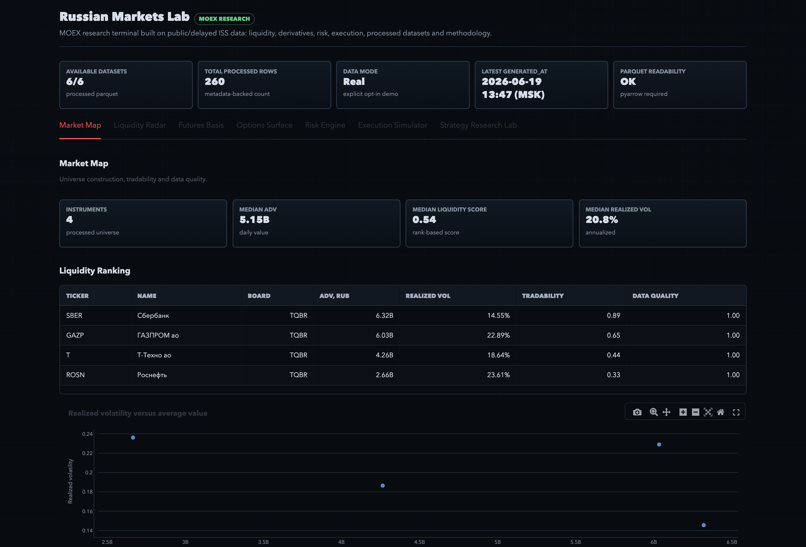
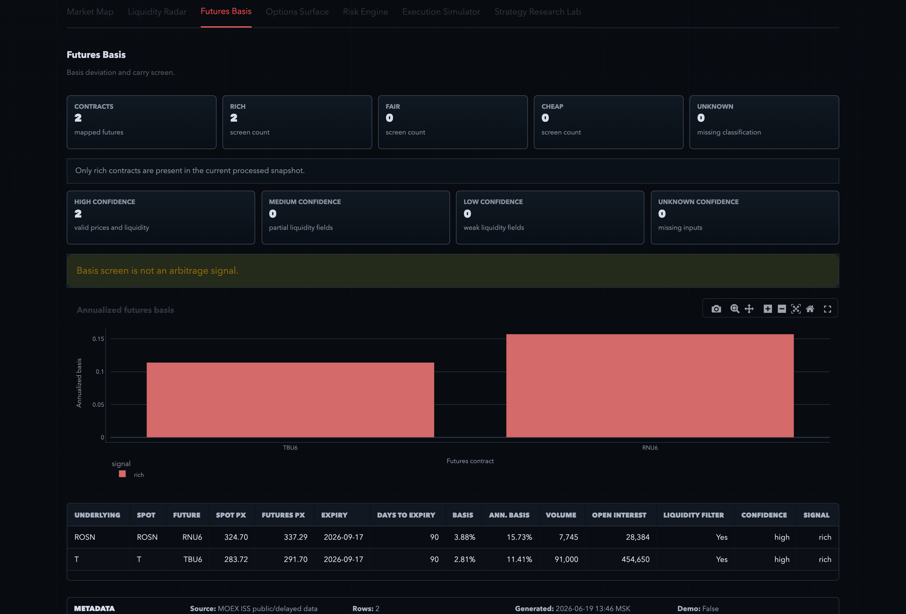

# Russian Markets Lab

Public research dashboard for MOEX market data, liquidity, futures basis, portfolio views and generated reports.

Market-data and reporting infrastructure demo for Russian markets. Built with Python and Streamlit.

[](pyproject.toml)
[](https://russian-markets-lab.streamlit.app/)
[](tests)
[](pyproject.toml)
[](pyproject.toml)
[](docs/data_sources.md)
[](docs/data_integrity_audit.md)
[](https://russian-markets-lab.streamlit.app/)

## Links

- [Live demo RU](https://russian-markets-lab.streamlit.app/?lang=ru)
- [Live demo EN](https://russian-markets-lab.streamlit.app/?lang=en)
- [Data integrity audit](docs/data_integrity_audit.md)
- [Project status](docs/project_status.md)
- [Screenshots](#screenshots)

## Screenshots

The screenshots below use the current Streamlit dashboard with processed datasets loaded and demo mode disabled. Click an image to open the full PNG.

[](docs/assets/dashboard-overview.png)

[](docs/assets/liquidity-radar.png)

[](docs/assets/futures-basis.png)

[](docs/assets/risk-engine.png)

## What It Is

Russian Markets Lab is a public proof of market-data and reporting infrastructure. It shows how recurring market snapshots, tables and research reports can be turned into a reproducible dashboard workflow.

The project currently uses public/delayed MOEX ISS data as its implemented data source. Processed datasets are stored as Parquet tables with metadata sidecars, then used by analytics modules, reports and the Streamlit dashboard.

## What It Does

- Builds MOEX market snapshots from public ISS instruments, marketdata and candles.
- Shows liquidity views with traded value, score components, spread handling and data-quality labels.
- Tracks futures basis as a rich/fair/cheap diagnostic with confidence labels.
- Builds options chain features and simplified IV/Greek diagnostics where public fields are usable.
- Shows portfolio/risk views with historical VaR, CVaR, volatility, drawdown, correlation, stress scenarios and approximate risk contribution.
- Compares simple execution styles with transparent cost assumptions.
- Generates HTML reports, notebooks, CLI outputs and dashboard views from the same processed data layer.
- Exposes real/demo data mode labels, cache/stale state and source metadata.

## What It Is Not

- Not investment advice.
- Not trading signals.
- Not a trading bot.
- Not a broker or execution system.
- No real order sending.
- No alpha, profit or arbitrage claims.
- No silent fake market data.

Demo mode is explicit, opt-in and visibly labeled in the dashboard. It is off by default.

## Data Integrity

Russian Markets Lab separates real processed data, demo data and missing data states.

- Real processed datasets are stored under `data/processed/` with matching `*.metadata.json` sidecars.
- Metadata includes row count, columns, source, generation time, limitations and `is_demo`.
- Raw ISS snapshots are local cache artifacts under `data/raw/`.
- Demo data is isolated in `src/russian_markets_lab/demo/`.
- The dashboard shows `cache`, `stale`, `demo` or `missing` data modes.
- Unreadable Parquet files fall back to metadata-backed status instead of reporting fake zero-row data.

Read the full [data integrity audit](docs/data_integrity_audit.md).

## Workflow

```text
MOEX ISS public/delayed data
-> raw cached tables
-> processed parquet datasets
-> pandas analytics
-> reports, notebooks, dashboard
```

MOEX ISS is the first implemented data source. Parts of the analytics layer are written around normalized pandas DataFrames, so the same structure can later be extended to CSV files or other market data sources. This is a design direction, not a claim that the current project is already fully market-agnostic.

## Quickstart

```bash
git clone https://github.com/sergey-lastochkin/russian-markets-lab.git
cd russian-markets-lab
python -m venv .venv
source .venv/bin/activate
pip install -r requirements.txt
pip install -e .
```

Run the dashboard:

```bash
streamlit run src/russian_markets_lab/dashboard/app.py
```

Build the full processed snapshot:

```bash
python -m russian_markets_lab.cli build-all --tickers-limit 30 --lookback-days 365
```

Inspect dataset provenance:

```bash
python -m russian_markets_lab.cli dataset-status
```

## Checks

These commands are part of the current local hardening flow:

```bash
python -m compileall src tests
pytest -q
ruff check .
black --check .
python -m russian_markets_lab.cli dataset-status
make test
make lint
```

## Project Structure

```text
russian-markets-lab/
  data/processed/               processed parquet datasets and metadata
  data/raw/                     local public-ISS cache snapshots
  docs/                         methodology, limitations, audit and status notes
  notebooks/                    research notebooks
  reports/                      generated HTML reports
  src/russian_markets_lab/
    moex_client/                MOEX ISS endpoint wrappers
    data/                       cache, metadata and processed IO
    analytics/                  liquidity, basis, options, risk and execution logic
    pipelines/                  raw-to-processed dataset builders
    dashboard/                  Streamlit frontend
    reports/                    report builders
    strategies/                 research templates
  tests/                        unit tests without live internet dependency
```

The dashboard is a frontend for processed datasets. Core logic stays in the data, analytics and pipeline modules.

## Documentation

- [Methodology](docs/methodology.md)
- [Data sources](docs/data_sources.md)
- [Limitations](docs/limitations.md)
- [Audit](docs/audit.md)
- [Data integrity audit](docs/data_integrity_audit.md)
- [Project status](docs/project_status.md)
- [Public readiness review](docs/public_readiness.md)

## Limitations

- MOEX ISS public data can be delayed, incomplete, sparse or temporarily unavailable.
- Processed snapshots can become stale if pipelines are not rerun.
- Futures and options mappings are best-effort diagnostics.
- Public data does not include full broker routing, queue position or complete order-book depth.
- Risk metrics are historical and backward-looking.
- Execution modeling is simplified and does not represent real order placement.
- The project is intended as a research/reporting demo, not a production trading system.

## Planned Improvements

- Add CSV input for external market data.
- Define a cleaner normalized market data schema.
- Improve futures and options contract mapping.
- Deepen execution cost and transaction-cost analysis.
- Add more realistic examples and research notebooks.

## Portfolio Context

This project is part of a broader market-data/reporting tools portfolio.

## Disclaimer

This project is for research, educational and portfolio review purposes. It does not provide investment advice, trading signals, brokerage functionality or real-money order execution.

## Author and Copyright

Created and maintained by Sergey Goncharov.

© 2026 Sergey Goncharov. All rights reserved.

This repository is published for portfolio and educational review purposes. No permission is granted to copy, modify, redistribute, sublicense, or use this code commercially without explicit written permission from the author.
