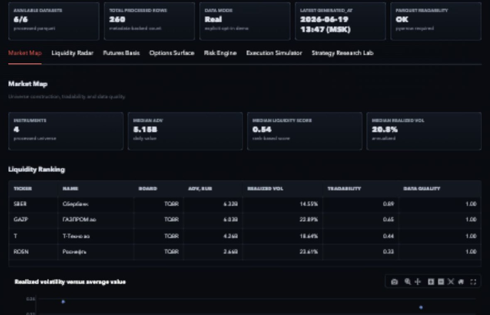
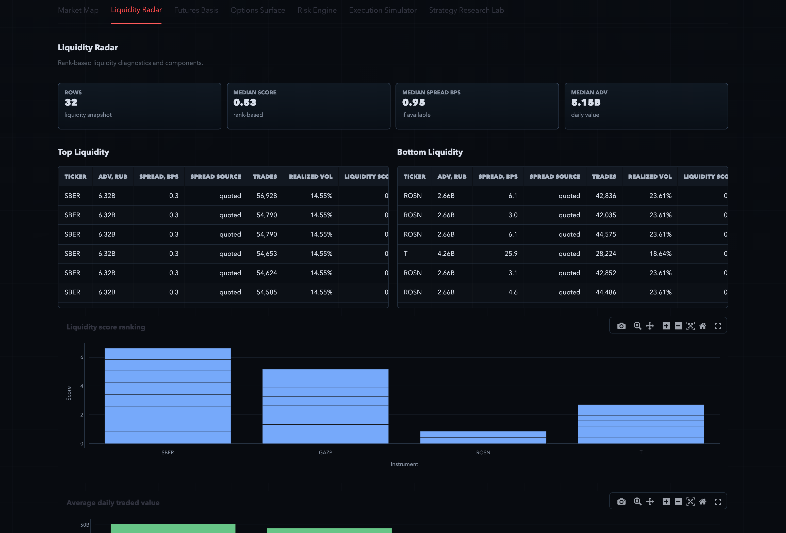
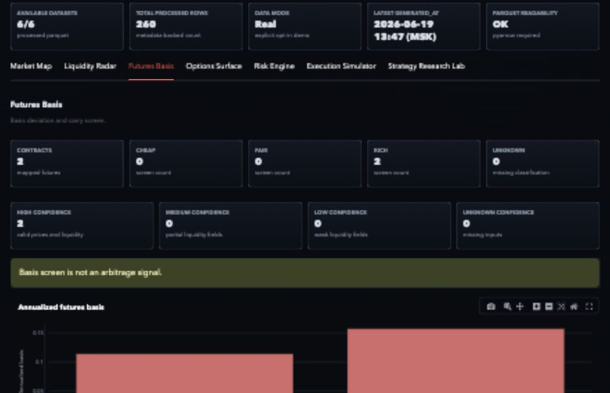
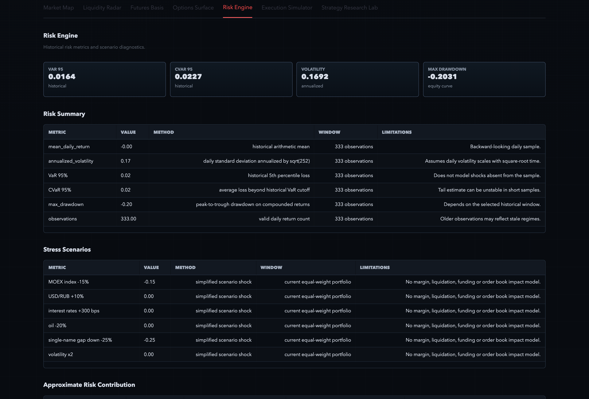

# Russian Markets Lab


Research platform for MOEX liquidity, derivatives, risk, and execution analysis.

Russian Markets Lab is a Python project for working with public/delayed MOEX ISS market data. It is not an order-sending app, not a signal service, and not a source of return claims. The goal is to keep the research workflow reproducible and easy to inspect.

Current status: broad research prototype under active hardening. It already has data ingestion, raw and processed dataset storage, analytics modules, notebooks, reports, tests, and a Streamlit dashboard. The project is useful as a portfolio/research stack, but it is still being validated and cleaned up.

## Workflow

The project follows a simple workflow:

1. Load market data from MOEX ISS.
2. Save raw and processed datasets.
3. Calculate research metrics.
4. Generate notebooks and HTML reports.
5. Show results in a Streamlit dashboard.

```text
MOEX ISS public/delayed data
-> raw cached tables
-> processed parquet datasets
-> pandas analytics
-> reports, notebooks, dashboard
```

MOEX ISS is the first implemented data source. Most analytics modules work with normalized pandas DataFrames rather than raw MOEX API responses, so parts of the analytics layer can later be reused for CSV files or other market data sources. That is a design direction, not a claim that the project is already fully data-source agnostic.

## What It Does

- Builds a MOEX market universe from instruments, marketdata, and candles.
- Calculates first-pass liquidity diagnostics: traded value, turnover, spread proxy, volatility penalty, and score components.
- Monitors futures basis as a rich/fair/cheap screen, not as an arbitrage signal.
- Builds options chain features, implied volatility, and Greeks where public fields are usable.
- Estimates portfolio risk from historical daily returns: VaR, CVaR, volatility, drawdown, correlation, and stress scenarios.
- Compares simple execution styles with transparent cost assumptions: market, limit, TWAP, and VWAP.
- Provides research notebooks, HTML reports, CLI commands, and a Streamlit dashboard.

## What It Does Not Do

- No broker integration.
- No real order sending.
- No private API keys.
- No personal PnL tracking.
- No investment advice or trading signals.
- No performance promises.
- No silent fake data. Demo data is opt-in and visibly marked.

## Project Layout

```text
russian-markets-lab/
  docs/                         methodology, data sources, limitations, audit
  data/raw/                     local raw cache snapshots
  data/processed/               parquet datasets with metadata sidecars
  src/russian_markets_lab/
    moex_client/                MOEX ISS client and endpoint wrappers
    data/                       metadata, processed IO, raw cache
    analytics/                  universe, liquidity, basis, options, risk, execution
    pipelines/                  raw-to-processed dataset builders
    strategies/                 research strategy templates
    backtester/                 vectorized backtest utilities
    dashboard/                  Streamlit frontend
    reports/                    HTML report builders
    scripts/                    orchestration entrypoints
  notebooks/                    research notebooks
  tests/                        unit tests without live internet dependency
```

The dashboard is only a frontend for the processed datasets. The main work happens in the data, analytics, and pipeline modules.

## Data

Russian Markets Lab currently uses MOEX ISS as its main data source.

Processed datasets are stored as Parquet files with JSON metadata sidecars:

- `data/processed/market_universe.parquet`
- `data/processed/liquidity_radar.parquet`
- `data/processed/futures_basis.parquet`
- `data/processed/options_chain_features.parquet`
- `data/processed/risk_snapshot.parquet`
- `data/processed/execution_comparison.parquet`

Each processed dataset has a matching `*.metadata.json` file with source, row count, columns, generation time, parameters, and limitations.

Raw ISS snapshots are stored locally under:

```text
data/raw/<dataset_name>/<timestamp>.parquet
data/raw/<dataset_name>/<timestamp>.metadata.json
```

The repository keeps `data/raw/` empty by default except for `.gitkeep`, because raw snapshots are generated locally when the pipeline runs.

## Modules

1. **MOEX Market Universe Scanner**: instruments, marketdata, candles, tradability, and data quality.
2. **Liquidity Radar**: liquidity scores, score components, turnover, spread handling, and volume spikes.
3. **Futures Basis Monitor**: basis, annualized basis, liquidity/confidence labels, and rich/fair/cheap classification.
4. **Options Volatility Surface**: chain features, moneyness, time to expiry, IV, Greeks, term profile, and surface proxy.
5. **Portfolio Risk Engine**: historical risk metrics, drawdown, correlation, approximate risk contribution, and stress scenarios.
6. **Execution Simulator**: spread crossing, slippage, market impact, fill-rate assumptions, and cost comparison.
7. **Strategy Research Lab**: simple research templates with cost sensitivity and failure analysis.
8. **Streamlit Dashboard**: EN/RU selector, dataset status, metadata, charts, and explicit demo mode.
9. **Research Reports**: HTML reports with methodology, metadata, limitations, and disclaimer.

## Dashboard Screenshots

Focused screenshots were generated from the current Streamlit dashboard with processed datasets loaded and demo mode disabled. Click any image to open the full PNG.

[](assets/readme_dashboard_overview.png)

[](assets/readme_liquidity_radar.png)

[](assets/readme_futures_basis.png)

[](assets/readme_risk_engine.png)

## Documentation

- [Methodology](docs/methodology.md)
- [Data Sources](docs/data_sources.md)
- [Limitations](docs/limitations.md)
- [Audit](docs/audit.md)
- [Project Status](docs/project_status.md)
- [Public Readiness Review](docs/public_readiness.md)

## Quickstart

```bash
git clone https://github.com/sergey-lastochkin/russian-markets-lab.git
cd russian-markets-lab
python -m venv .venv
source .venv/bin/activate
pip install -r requirements.txt
pip install -e .
```

Windows:

```bat
.venv\Scripts\activate
```

## Build Data

Build the full research snapshot:

```bash
python -m russian_markets_lab.cli build-all --tickers-limit 30 --lookback-days 365
```

Other useful commands:

```bash
python -m russian_markets_lab.cli build-universe --tickers-limit 30 --lookback-days 365
python -m russian_markets_lab.cli build-liquidity
python -m russian_markets_lab.cli build-futures-basis
python -m russian_markets_lab.cli build-options --max-contracts 200
python -m russian_markets_lab.cli build-risk
python -m russian_markets_lab.cli build-execution
python -m russian_markets_lab.cli dataset-status
```

## Run Dashboard

```bash
streamlit run src/russian_markets_lab/dashboard/app.py
```

The dashboard defaults to English, includes an EN/RU selector, and has an explicit demo-mode checkbox. Demo mode is off by default.

## Live Demo

Live demo: https://russian-markets-lab.streamlit.app/

A Streamlit demo can be deployed from this repository using:

- Repository: `sergey-lastochkin/russian-markets-lab`
- Branch: `main`
- Main file path: `src/russian_markets_lab/dashboard/app.py`

The dashboard uses committed processed datasets when available. Demo mode remains off by default.

## Run Checks

```bash
pytest
python -m compileall src tests
ruff check .
black --check .
```

Makefile shortcuts:

```bash
make test
make lint
make build-data
make dashboard
```

## Planned Improvements

- Add CSV input for external market data.
- Define a cleaner normalized market data schema.
- Improve futures and options contract mapping.
- Deepen execution cost and TCA analytics.
- Add more realistic examples and research notebooks.

## Disclaimer

This project is for research and educational purposes only. It does not provide investment advice, trading signals, brokerage functionality, or real-money order execution.

## Author and Copyright

Created and maintained by Sergey Goncharov.

© 2026 Sergey Goncharov. All rights reserved.

This repository is published for portfolio and educational review purposes. No permission is granted to copy, modify, redistribute, sublicense, or use this code commercially without explicit written permission from the author.
