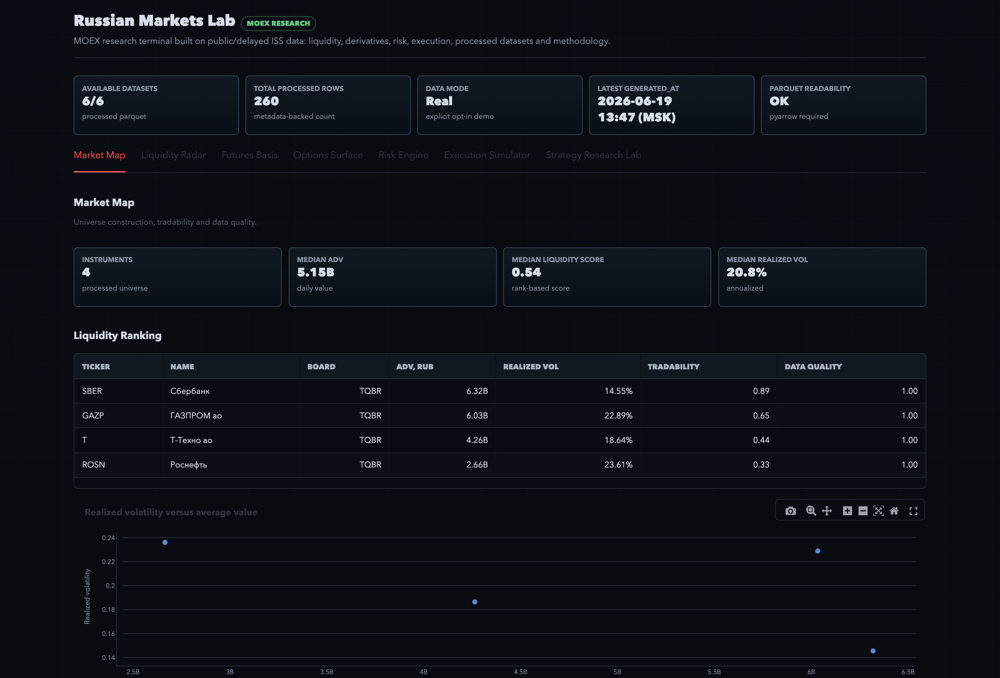
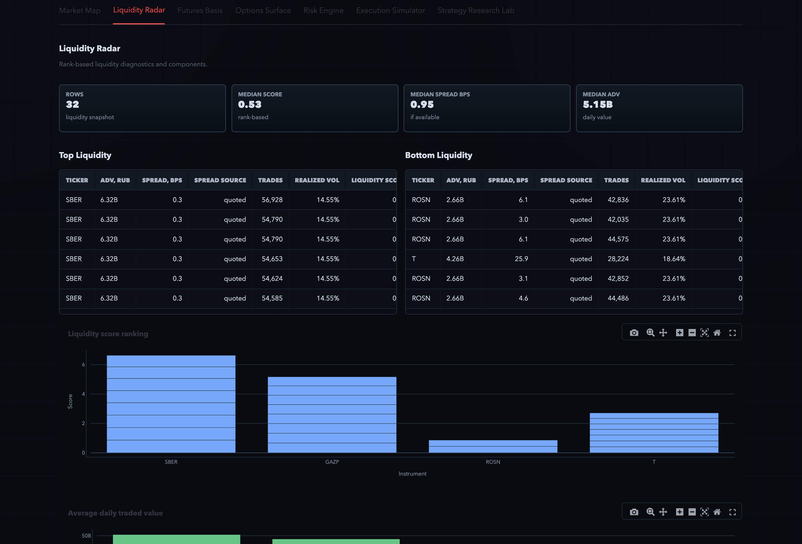

# Russian Markets Lab

Дополнительный исследовательский проект на публичных данных MOEX ISS: обработка
рынка, ликвидность, фьючерсный basis, исторический риск и отчёты Streamlit.
Это не инвестиционный сервис, торговый робот или источник торговых сигналов.



В Git лежит обработанный snapshot от 2026-06-19 с metadata sidecars. Он
получен из публичных endpoint MOEX ISS, но на 2026-08-10 уже не считается
актуальной рыночной картиной. Проект не использует старые данные как текущий
результат и показывает их происхождение отдельно от demo mode.



## Что здесь есть

- загрузка публичных marketdata и candles MOEX ISS в локальный cache;
- обработанные Parquet наборы с источником, временем, числом строк и
  ограничениями в `*.metadata.json`;
- диагностики ликвидности, basis, опционных греков, historical VaR/CVaR,
  drawdown и execution cost assumptions;
- отчёты и Streamlit dashboard поверх одного processed data layer.

Проверяемые метаданные snapshot находятся в
[`data/processed/`](data/processed/). Устройство методов и ограничения:
[источники данных](docs/data_sources.md), [методика](docs/methodology.md),
[ограничения](docs/limitations.md), [целостность данных](docs/data_integrity_audit.md).

## Как обновить данные

```bash
python -m venv .venv
source .venv/bin/activate
pip install -r requirements.txt
pip install -e .
python -m russian_markets_lab.cli build-all --tickers-limit 30 --lookback-days 365
python -m russian_markets_lab.cli dataset-status
streamlit run src/russian_markets_lab/dashboard/app.py
```

Перед выводами о рынке нужно проверить timestamps и `is_demo` каждого
dataset. При недоступности источника dashboard обязан показывать stale или
missing state, а не нулевые показатели как реальные.

## Границы

- MOEX ISS может быть задержанным, неполным или временно недоступным.
- Public data не содержит полного order book, broker routing и фактической
  очереди исполнения.
- Risk и execution diagnostics основаны на исторических данных и допущениях;
  они не прогнозируют будущий результат.
- Локально на 2026-08-10 зависимости проекта не переустанавливались и полный
  build snapshot не повторялся. Последний подтверждённый committed snapshot
  датирован 2026-06-19.
