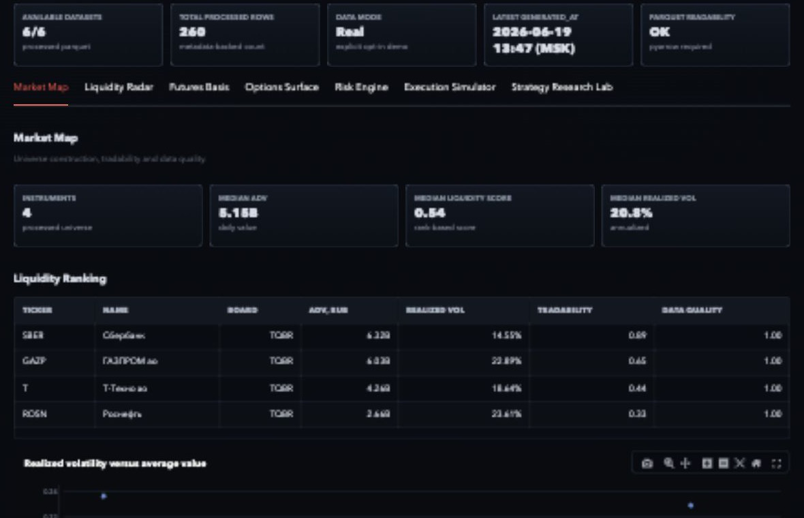

# Russian Markets Lab

[](https://github.com/sergey-lastochkin/russian-markets-lab/actions/workflows/ci.yml)

Исследовательский проект на публичных данных MOEX ISS: ликвидность, фьючерсный базис, исторический риск и отчёты Streamlit. Это не торговый робот, не инвестиционный сервис и не источник сигналов.



В Git сохранён обработанный набор от `2026-06-19`. Он получен из публичных endpoint MOEX ISS, но на `2026-08-10` уже не является текущей картиной рынка. Дата и режим данных показаны на скриншоте и в [метаданных](data/processed/).

Набор включает 6 таблиц и 260 обработанных строк. Код хранит источник, время формирования, число строк и ограничения рядом с каждым Parquet-файлом. Если источник недоступен или данные устарели, интерфейс должен показать это состояние, а не нулевые показатели как фактические.

[Источники](docs/data_sources.md) · [Методика](docs/methodology.md) · [Ограничения](docs/limitations.md) · [Проверка целостности данных](docs/data_integrity_audit.md)

## Как обновить данные

```bash
python -m venv .venv
source .venv/bin/activate
pip install -r requirements.txt
pip install -e .
python -m russian_markets_lab.cli build-all --tickers-limit 30 --lookback-days 365
python -m russian_markets_lab.cli dataset-status
streamlit run src/russian_markets_lab/dashboard/app.py
```

Перед выводами о рынке нужно проверить время формирования и `is_demo` каждого набора. Текущий полный build здесь не запускался: зависимости не переустанавливались, а подтверждённый committed dataset остался от `2026-06-19`.

## Проверки

```bash
PYTHONPATH=src python -m pytest
ruff check src tests
python -m compileall -q src tests
```

Эти проверки используют committed данные и фикстуры. Они не запускают `build-all`, не запрашивают MOEX ISS и не формируют торговые рекомендации.

## Границы

- Публичный MOEX ISS может быть задержанным, неполным или временно недоступным.
- В публичных данных нет полной очереди заявок, маршрута брокера и фактического исполнения.
- Риск и стоимость исполнения основаны на исторических данных и допущениях; они не прогнозируют будущий результат.
