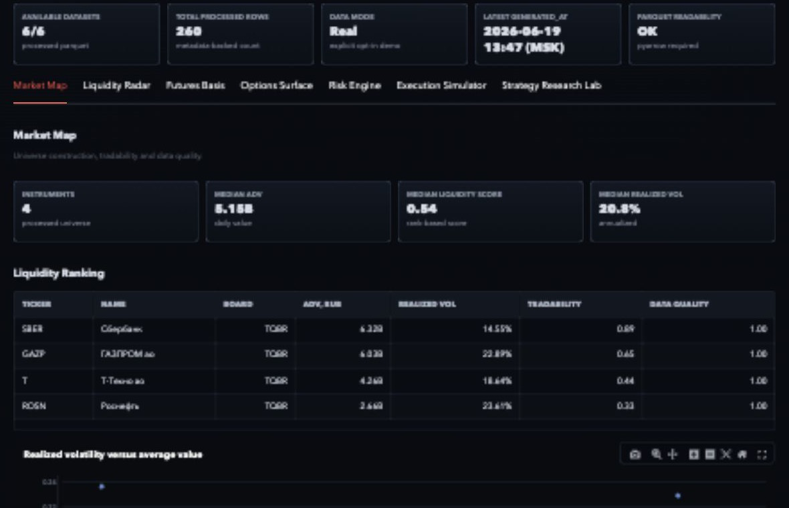
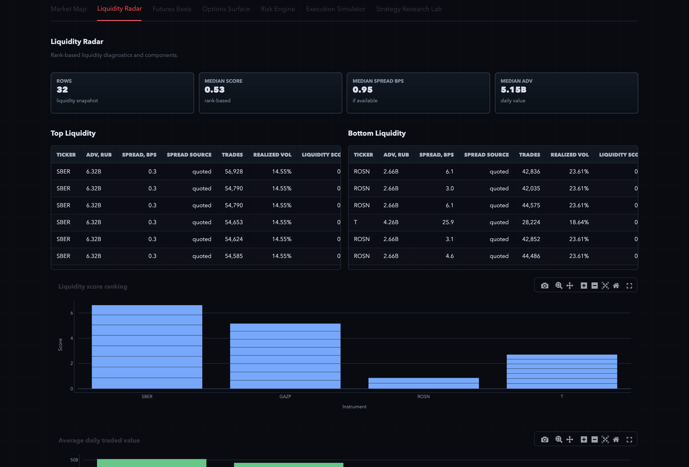

# Russian Markets Lab

[](https://github.com/sergey-lastochkin/russian-markets-lab/actions/workflows/ci.yml)

**Исследовательский конвейер на публичных данных MOEX ISS: ликвидность,
фьючерсный базис, исторический риск и дашборд на Streamlit.** Не торговый робот,
не инвестиционный сервис и не источник сигналов.



## Какую проблему решает

Публичный MOEX ISS отдаёт данные с задержками, пропусками и в неудобном виде.
Проект собирает их в воспроизводимые наборы: у каждого Parquet-файла рядом лежат
источник, время формирования, число строк и ограничения. Если данные устарели или
источник недоступен, интерфейс показывает это состояние, а не нули как факт.

## Для кого

- Студенты и аналитики, которым нужен каркас исследования российского рынка на
  открытых данных.
- Команды хакатонов по финансовым данным — как готовая основа с проверками
  целостности.

## Запуск за 2 минуты

Дашборд на сохранённом наборе данных (без запросов к MOEX):

```bash
git clone https://github.com/sergey-lastochkin/russian-markets-lab.git
cd russian-markets-lab
python -m venv .venv && source .venv/bin/activate
pip install -r requirements.txt && pip install -e .
python -m russian_markets_lab.cli dataset-status
streamlit run src/russian_markets_lab/dashboard/app.py
```

Обновить данные с MOEX ISS:

```bash
python -m russian_markets_lab.cli build-all --tickers-limit 30 --lookback-days 365
```

## Пример результата

В Git сохранён обработанный набор от `2026-06-19`: 6 таблиц, 260 строк —
вселенная инструментов, радар ликвидности, фьючерсный базис, признаки опционной
доски, сравнение исполнения. Метаданные каждого набора — в
[data/processed](data/processed/).



[Источники](docs/data_sources.md) · [методика](docs/methodology.md) ·
[проверка целостности](docs/data_integrity_audit.md)

## Ограничения

- Сохранённый набор от 2026-06-19 — это не текущий рынок. Перед выводами
  проверяйте время формирования и флаг `is_demo`.
- В публичных данных нет полной очереди заявок, маршрута брокера и фактического
  исполнения.
- Риск и стоимость исполнения — исторические оценки с допущениями, не прогноз.
- CI проверяет код на сохранённых данных и фикстурах и не обращается к MOEX ISS.

## Автор

Сергей Ласточкин · Telegram [@metaanswer](https://t.me/metaanswer) ·
[другие проекты](https://github.com/sergey-lastochkin)
